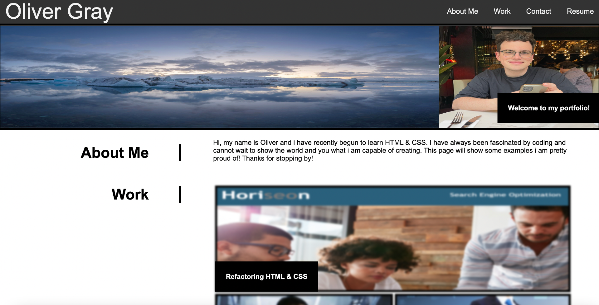

Oliver Gray's week 2 challenge: Oliver Gray's Portfolio

Please find live link here: https://ogray96.github.io/Oliver-Gray-Portfolio/

This project required us to create a portfolio to display our work and supply ways to be contacted. Furthermore it required us to use methods that we had learned in order to create a responsive website. This was done by using advanced methods of CSS.

